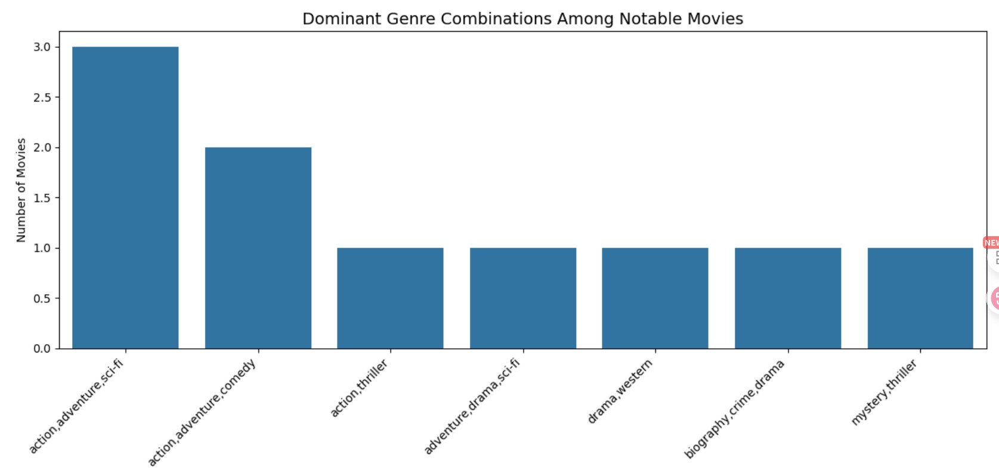

# Movie ROI & Genre Performance Analysis

## Overview

This project explores the financial performance of movies by analyzing production budgets, revenues, and genre combinations. Using datasets from IMDb, The Numbers (TN), and Box Office Mojo (BOM), the goal is to identify which types of films yield the highest return on investment (ROI) and what storytelling patterns dominate top-rated cinema.

---

## Business Understanding

### Objective

A new film studio wants to make data-driven decisions when selecting which types of films to produce. They need insights into:

- Which genres or genre combinations consistently perform well?
- How does production budget influence financial returns?
- Are critically acclaimed movies also commercially successful?

### Stakeholders

- Studio executives and producers
- Marketing and finance teams
- Data analytics department

### Key Business Questions

1. What are the most successful genre combinations among high-rated films?
2. Which films and genres offer the best ROI?
3. How does budget correlate with financial performance?
4. Are high IMDb ratings and vote counts predictive of financial success?
5. How has ROI changed over the years?

---

## Data Understanding and Analysis

### Data Sources

- **IMDb**: Ratings, genres, and vote counts
- **The Numbers (TN)**: Production budgets and worldwide grosses
- **Box Office Mojo (BOM)**: Additional domestic and foreign gross data

### Description of Data

- **IMDb**: `title`, `start_year`, `averagerating`, `numvotes`, `genres`
- **TN**: `production_budget`, `worldwide_gross`, `title`, `release_date`
- **BOM**: `domestic_gross`, `foreign_gross`, `studio`, `title`, `year`

> Merged data was filtered to include only notable movies with at least 10,000 votes and IMDb ratings > 6.5, and with minimum gross revenue of $1M.

---

## Visualizations

### 1. Most Common Genre Combinations in Top Movies

- **Top combos:** Action–Adventure–Sci-Fi and Action–Adventure–Comedy
- Insight: Audiences love fast-paced, high-energy narratives with humor or futuristic themes.

---

### 2. Genres with Highest ROI

- **Top genres by average ROI:** Music, Horror, Mystery
- Insight: Low-to-mid budget genres often yield stronger returns.

---

### 3. ROI vs Production Budget

- Insight: There's no strong correlation between bigger budgets and higher ROI. In fact, many lower-budget films perform better in relative financial terms.

---

## Conclusion

### Summary of Findings

1. **Music and Horror genres deliver the highest average ROI**, making them strong candidates for budget-conscious investments.
2. **Popular genre combinations like Action–Adventure–Sci-Fi** dominate high-rated movies but don’t always guarantee strong returns.
3. **High IMDb ratings and vote counts are weakly correlated with ROI**, suggesting commercial and critical success don’t always align.

### Business Recommendations

1. **Invest in high-ROI genres** like *music* and *horror*, especially for studios with limited budgets.
2. **Avoid assuming bigger budgets yield bigger profits**—a controlled budget with a compelling concept can outperform high-spend productions.
3. **Use genre combinations that resonate with audiences**, but balance creativity with cost discipline.

---

## Next Steps

1. **Deep-dive into high-ROI genres** to analyze marketing strategies and production styles.
2. **Model ROI by budget ranges** to inform investment strategy.
3. **Incorporate audience sentiment data** from reviews and social platforms.
4. **Build an interactive dashboard** to explore trends in real time.

---

## Project Files

- [Jupyter Notebook: working_notebook.ipynb](./working_notebook.ipynb)
- [Presentation Slides: presentation.pdf](./presentation.pdf)
- [Image folder (ERD and Visualization screenshot)](image)
- [zippedData](data/)
- [README.md](README.md)